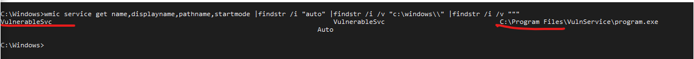
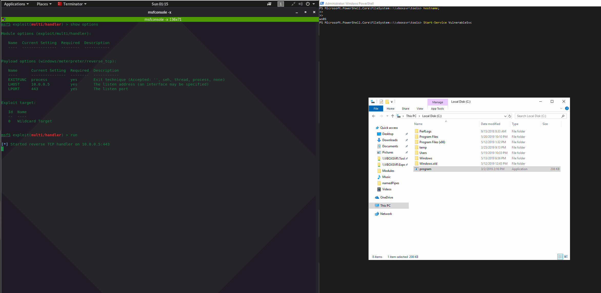

# Unquoted Service Paths

Sometimes it is possible to escalate privileges by abusing misconfigured services. Specifically, this is possible if path to the service binary is not wrapped in quotes and there are spaces in the path.. This stems from the way Windows handles `CreateProcess` API calls:

> If you are using a long file name that contains a space, use quoted strings to indicate where the file name ends and the arguments begin; otherwise, the file name is ambiguous. For example, consider the string "c:\program files\sub dir\program name". This string can be interpreted in a number of ways. The system tries to interpret the possibilities in the following order:
>
> **c:\program.exe** **c:\program files\sub.exe** **c:\program files\sub dir\program.exec:\program files\sub dir\program name.exe...**
>
> \*\*\*\*[https://docs.microsoft.com/en-us/windows/desktop/api/processthreadsapi/nf-processthreadsapi-createprocessa](https://docs.microsoft.com/en-us/windows/desktop/api/processthreadsapi/nf-processthreadsapi-createprocessa)

## Enumeration

Let's scan the system `ws01` for any potentially misconfigured services - those services that do not have their binary paths wrapped in quotes:


```text
cmd /c wmic service get name,displayname,pathname,startmode |findstr /i "auto" |findstr /i /v "c:\windows\\" |findstr /i /v """
```


One service is returned:



The above suggests that if we can drop our binary to `c:\program.exe`, we may be able to stop/start the `VulnerableSvc` and get our binary at `c:\program.exe` to run with NT\System privileges:


## Execution

Let's try exploiting the weakness in by droping a meterpreter binary to c:\program.exe and starting the vulnerable service `VulnerableSvc`. Doing so gives us a meterpreter session with `nt authority\system` privileges:



