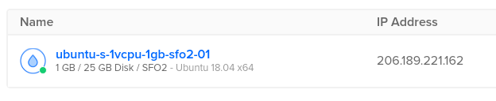
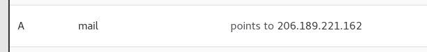
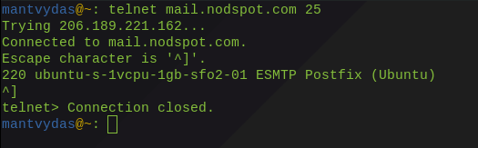
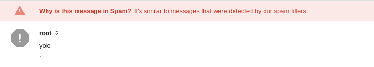
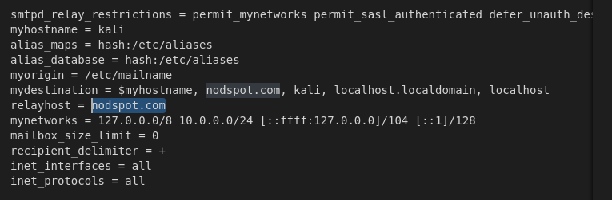
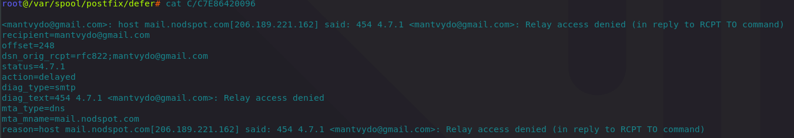
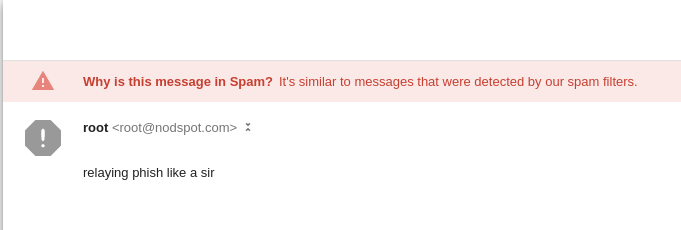
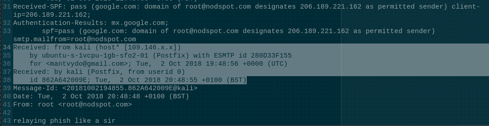
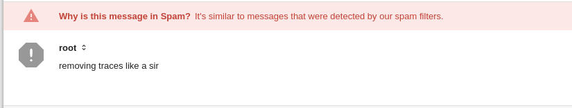
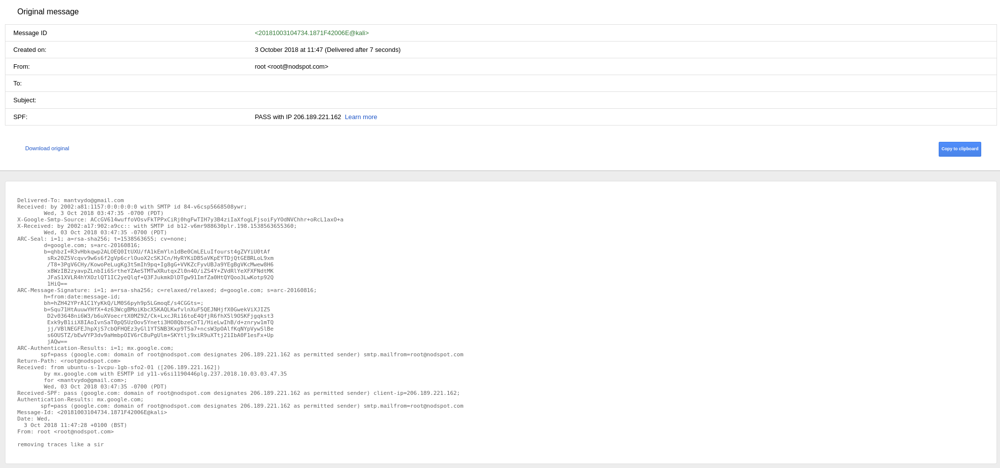

# SMTP Forwarders / Relays

## Setting up Relay Mail Server

I am going to set up a mail server that will be later used as an SMTP relay server. First off, a new Ubuntu droplet was created in Digital Ocean:



Postfix MTA was installed on the droplet with:

```text
apt-get install postfix
```

During postfix installation, I set `nodspot.com` as the mail name. After the installation, this can be checked/changed here:

```csharp
root@ubuntu-s-1vcpu-1gb-sfo2-01:~# cat /etc/mailname
nodspot.com
```

## DNS Records

DNS records for nodspot.com has to be updated like so:




## Testing Mail Server

Once postfix is installed and the DNS records are configured, we can test if the mail server is running by:

```csharp
telnet mail.nodspot.com 25
```

If successful, you should see something like this:



We can further test if the mail server works by trying to send an actual email like so:

```csharp
root@ubuntu-s-1vcpu-1gb-sfo2-01:~# sendmail mantvydo@gmail.com
yolo
,
.
```

Soon enough, the email comes to my gmail:



...with the following headers - all as expected. Note that at this point the originating IP seen in headers is my droplet IP 206.189.221.162:

```csharp
Delivered-To: mantvydo@gmail.com
Received: by 2002:a81:1157:0:0:0:0:0 with SMTP id 84-v6csp5026946ywr;
        Tue, 2 Oct 2018 12:22:38 -0700 (PDT)
X-Google-Smtp-Source: ACcGV62oH69fwYnfV1zg+o+jbTpjQIzIzASmjoIsXbbfvdevE0LlkY32jflNS/acOtNBXiwzxYxP
X-Received: by 2002:a62:6547:: with SMTP id z68-v6mr17716388pfb.20.1538508158395;
        Tue, 02 Oct 2018 12:22:38 -0700 (PDT)
ARC-Seal: i=1; a=rsa-sha256; t=1538508158; cv=none;
        d=google.com; s=arc-20160816;
        b=FpEgLAICLn66cI+DDvpIsStUrReQ8fArcreT7FyS8SYcFQXFiK44HDcxwVHXCA8Xxb
         fUl+3HcerQEznHZMttZ4pZIMbN18pJS08wzuZdOlhGKAA2JSTkxGd+1PhJwDe1SFTYZc
         NoARSHL9opemJKg5YqZNjSTDSTfk/QqaCbq7mQL9LAwCKzanGSNR/R/28WymYrdRACOR
         GSmDCVvPaUaoemIP8+GwXkfU5Gkk49+F7t9Jbg23HKKq/YOhwF3ryeOEVfn74bhtZIkM
         QcUzWn5WSL0lIm0nbd2t7677/wcabOg0TCoZj1IHg+I7yLXE7+QZOYX1TguKu16oZeqt
         mTIA==
ARC-Message-Signature: i=1; a=rsa-sha256; c=relaxed/relaxed; d=google.com; s=arc-20160816;
        h=from:date:message-id;
        bh=VSFU9fKoMQMmtQzPFdmefDuA+phTpwZXd9k5xGRzwRs=;
        b=VZ2vHjhPUSs17PXAUDyjYzm0w5sdQYqFx7h9iirh/BF1krrl3MQg4QAgfeo0py9qZH
         Xf8/9HmNe1pIgxnZiiZJeVijXeSHCIB4XkG4HYFJY2m/gQ9oZ4JSMfX/Kiw/CXEmbt71
         YP5S7yQKQNkHw24XnP3WUeDDQ7XvENEfPIS+LlCVtQOPT8fM9TAWQReKz06idynolfhR
         7P73wH8igwPea7586wdhSOtDYCURSMKTNVb8yP2eEPNBlP2u2jUrFImG2D2/lke4O6Iu
         7zu96tCYEY9FVG11dPFheKlMjvMoL4rqPSAQ3zty4Cbi4Vy2Is6f/VF8AYZ34i0FJooj
         eEkw==
ARC-Authentication-Results: i=1; mx.google.com;
       spf=pass (google.com: domain of root@nodspot.com designates 206.189.221.162 as permitted sender) smtp.mailfrom=root@nodspot.com
Return-Path: <root@nodspot.com>
Received: from ubuntu-s-1vcpu-1gb-sfo2-01 ([206.189.221.162])
        by mx.google.com with ESMTP id 38-v6si3160283pgr.237.2018.10.02.12.22.38
        for <mantvydo@gmail.com>;
        Tue, 02 Oct 2018 12:22:38 -0700 (PDT)
Received-SPF: pass (google.com: domain of root@nodspot.com designates 206.189.221.162 as permitted sender) client-ip=206.189.221.162;
Authentication-Results: mx.google.com;
       spf=pass (google.com: domain of root@nodspot.com designates 206.189.221.162 as permitted sender) smtp.mailfrom=root@nodspot.com
Received: by ubuntu-s-1vcpu-1gb-sfo2-01 (Postfix, from userid 0) id DC6DD3F156; Tue,
  2 Oct 2018 19:22:37 +0000 (UTC)
Message-Id: <20181002192237.DC6DD3F156@ubuntu-s-1vcpu-1gb-sfo2-01>
Date: Tue,
  2 Oct 2018 19:22:31 +0000 (UTC)
From: root <root@nodspot.com>

yolo
,
```

## Setting up Originating Mail Server

We need to set up the originating mail server that will use the server we set up earlier as a relay server. To achieve this, on my attacking machine, I installed postfix mail server.

The next thing to do is to amend the `/etc/postfix/main.cf` and set the `relayhost=nodspot.com`which will make the outgoing emails from the attacking system travel to the nodspot.com mail server \(the server we set up above\) first:



Once the change is made and the postfix server is rebooted, we can try sending a test email from the attacking server:


If you do not receive the email, make sure that the relay server is not denying access for the attacking machine. If you see your emails getting deferred \(on your attacking machine\) with the below message, it is exactly what is happening:



Once the relay issue is solved, we can repeat the test and see a successful relay:



This time the headers look like so:



Note how this time we are observing the originating host's details such as a host name and an IP address - this is unwanted and we want to redact that information out.



## Removing Sensitive Headers in Postfix

We need to make some configuration changes in the relay server in order to redact the headers for outgoing emails.

First off, let's create a file on the server that contains regular expressions that will hunt for the headers that we want removed:


```csharp
/^Received:.*/              IGNORE
/^X-Originating-IP:/    IGNORE
/^X-Mailer:/            IGNORE
/^Mime-Version:/        IGNORE
```


Next we need to amend the `/etc/postfix/master.cf` to include the following line: `-o header_checks=regexp:/etc/postfix/header_checks`:


This will tell the postfix server to remove headers from outgoing emails that match regular expressions found in the file we created above.

Save the changes and reload the postfix server:

```text
postmap /etc/postfix/header_checks
postfix reload
```

Now send a test email from the attacking machine again and inspect the headers of that email: 





Note how the `Received` headers exposing the originating \(the attacking\) machine were removed, which is exactly what we wanted to achieve:

```text
Delivered-To: mantvydo@gmail.com
Received: by 2002:a81:1157:0:0:0:0:0 with SMTP id 84-v6csp5668508ywr;
        Wed, 3 Oct 2018 03:47:35 -0700 (PDT)
X-Google-Smtp-Source: ACcGV614wuffoVOsvFkTPPxCiRj0hgFwTIH7y3B4ziIaXfogLFjsoiFyYOdNVChhr+oRcL1axO+a
X-Received: by 2002:a17:902:a9cc:: with SMTP id b12-v6mr988630plr.198.1538563655360;
        Wed, 03 Oct 2018 03:47:35 -0700 (PDT)
ARC-Seal: i=1; a=rsa-sha256; t=1538563655; cv=none;
        d=google.com; s=arc-20160816;
        b=qhbzI+R3vHbkqwp2ALOEQ0ItUXU/fA1kEmYln1dBe0CmLELuIfourst4gZVYiU0tAf
         sRx20Z5Vcqvv9w6s6f2gVp6crlOuoX2cSKJCn/HyRYKiDB5aVKpEYTDjQtGEBRLoL9xm
         /T8+3PgV6CHy/KowoPeLugKg3t5mIh9pq+Ig8gG+VVKZcFyvUBJa9YEgBgVKcMwew8H6
         x8WzIB2zyavpZLnbIi6SrtheYZAeSTMTwXRutqxZl0n4O/iZS4Y+ZVdRlYeXFXFNdtMK
         JFaS1XVLR4hYXOzlQT1IC2yeQlqf+Q3FJukmkDlDTgw91ImfZa0HtQYQoo3LwKotp92Q
         1HiQ==
ARC-Message-Signature: i=1; a=rsa-sha256; c=relaxed/relaxed; d=google.com; s=arc-20160816;
        h=from:date:message-id;
        bh=hZH42YPrA1C1YyKkQ/LM0S6pyh9p5LGmoqE/s4CGGts=;
        b=Squ71HtAuuwYHfX+4z63WcgBMoiKbcX5KAQLKwfvlnXuF5QEJNHjfX0GwekViXJIZ5
         D2v03648ni6W3/b6uXVoecrtX0MZ9Z/Ck+LxcJRi16toE4QfjR6fhX5l9OSKFjgqkst3
         Exk9yB1iiX8IAoIvnSaT0pQ5UzOov5Yneti3HO8QbzeCnT1/HieLwIhB/d+znryw1mTQ
         jj/VBlNEGFEJhpXjS7cbQFHQEz3yGl1YTSNB3Kxp9T5a7+ncsW3pOAlfKqNYpVywSlBe
         s6OUSTZ/bEwVYP3dv9aHmbpOIV6rC8uPgUlm+SKYtlj9xiR9uXTtj21IbA0F1esFx+Up
         jAQw==
ARC-Authentication-Results: i=1; mx.google.com;
       spf=pass (google.com: domain of root@nodspot.com designates 206.189.221.162 as permitted sender) smtp.mailfrom=root@nodspot.com
Return-Path: <root@nodspot.com>
Received: from ubuntu-s-1vcpu-1gb-sfo2-01 ([206.189.221.162])
        by mx.google.com with ESMTP id y11-v6si1190446plg.237.2018.10.03.03.47.35
        for <mantvydo@gmail.com>;
        Wed, 03 Oct 2018 03:47:35 -0700 (PDT)
Received-SPF: pass (google.com: domain of root@nodspot.com designates 206.189.221.162 as permitted sender) client-ip=206.189.221.162;
Authentication-Results: mx.google.com;
       spf=pass (google.com: domain of root@nodspot.com designates 206.189.221.162 as permitted sender) smtp.mailfrom=root@nodspot.com
Message-Id: <20181003104734.1871F42006E@kali>
Date: Wed,  3 Oct 2018 11:47:28 +0100 (BST)
From: root <root@nodspot.com>

removing traces like a sir
```



This lab is not going to deal with the emails being marked as phishing by gmail. This, however, is related to setting up DKIM, PTR records and the likes, see below for more references.

## References









