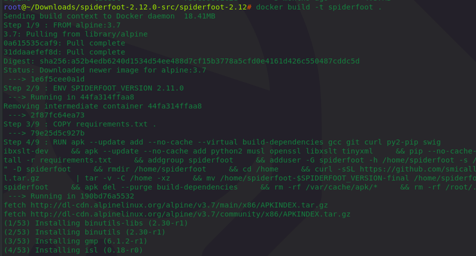
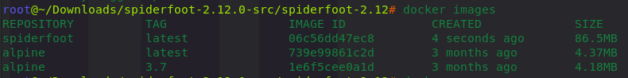
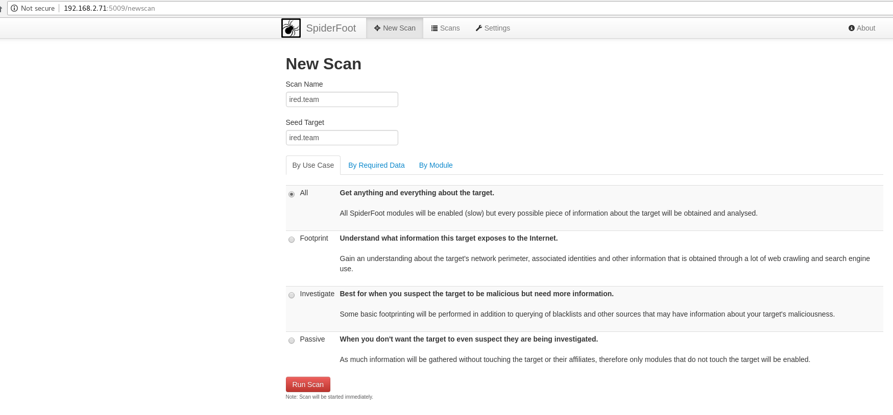

# Spiderfoot 101 with Kali using Docker

This lab walks through some simple steps required to get the OSINT tool Spiderfoot up and running on a Kali Linux using Docker.

Spiderfoot is an application that enables you as a pentester/red teamer to collect intelligence about a given subject - email address, username, domain or IP address that may help you in planning and advancing your attacks against them.

## Download Spiderfoot

Download the Spiderfoot linux package from [https://www.spiderfoot.net/download/](https://www.spiderfoot.net/download/) and extract it to a location of your choice on your file system.  
I extracted it to `/root/Downloads/spiderfoot-2.12.0-src/spiderfoot-2.12`

and made it my working directory:

```csharp
cd /root/Downloads/spiderfoot-2.12.0-src/spiderfoot-2.12
```

## Upgrade PIP

You may need to upgrade the pip before it starts giving you trouble:

```csharp
pip install --upgrade pip
```

## Build Docker Image

Build the spiderfoot docker image :

```text
docker build -t spiderfoot .
```



Check if the image got created successfully:

```
docker images
```

You should see the spiderfoot image creted seconds ago:



## Run the Spiderfoot Docker

```csharp
docker run -p 5009:5001 -d spiderfoot
```

The above will run previously created spiderfoot image in the background and expose a TCP port 5009 on the host computer. Any traffic sent to `host:5009` will be forwarded to the port 5001 on the docker where spiderfoot is running and listening.

To check if the docker image is running, we can do:

```text
docker ps
```

The below confirms the docker is indeed running the spiderfoot image and is listening on port 5001:


Below confirms that the host machine has now exposed the TCP port 5009 \(which forwards traffic to the docker's port 5001\):


## Using Spiderfoot

Navigate to your host:5009 to access the spiderfoot UI and start a new scan:



During the scan, we can start observing various pieces of data being returned from the internet:


Drilling down to one of the above categories - DNS records:


## References



